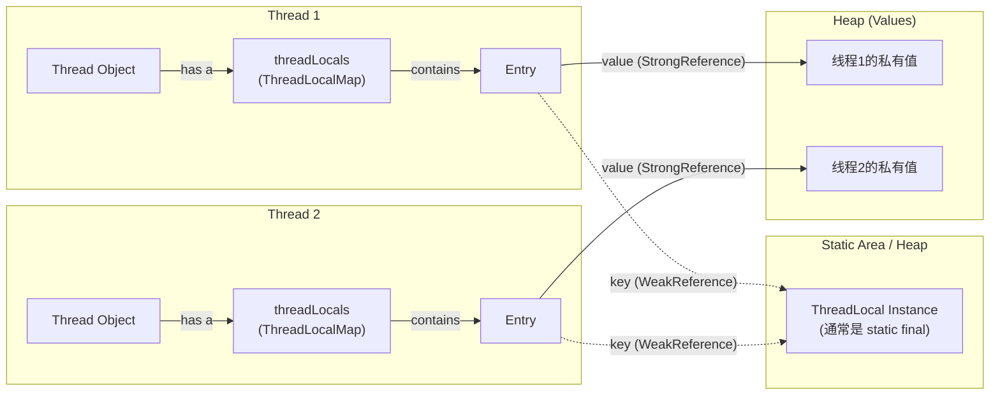

# 深入解析 ThreadLocal：从原理到内存泄漏

关于 ThreadLocal，大家普遍的认知是：它为每个线程提供了一个变量副本，从而实现了线程间的数据隔离。现在我们深入思考过以下这些问题，看看有没有清楚的对这个知识点有很好的掌握和理解。

- ThreadLocal 中的数据究竟是如何存储的？
- 为什么 ThreadLocalMap 中的 key 要设计成弱引用？那 value 为什么不是弱引用呢？
- 既然 key是弱引用，那么垃圾回收（GC）之后 key 一定会被回收变成 null 吗？
- 如果 key 变为 null，ThreadLocalMap 中是否会存在大量 key 为 null 的无效数据？这些数据又是如何被清理的？
- 为什么说 ThreadLocal 容易引发内存泄漏？我们又该如何避免？

## ThreadLocal 的存储原理

ThreadLocal 的数据到底是怎么存的呢？ 每个线程（Thread）内部都有一个名为 `threadLocals` 的成员变量，它的类型是 ThreadLocal.ThreadLocalMap。这个 ThreadLocalMap 本质上类似于一个 HashMap，其底层使用一个 Entry 数组来存储数据。

```java
// java.lang.Thread
public class Thread implements Runnable {
    // ...
    /* 此线程的 ThreadLocal 值。该映射由 ThreadLocal 类维护。*/
    ThreadLocal.ThreadLocalMap threadLocals = null;
    // ...
}
```

这个 ThreadLocalMap 本质上类似于一个 HashMap，其底层使用一个 Entry 数组来存储数据。

这个 Entry 的结构很关键：

- **Key**: Entry 的 key 是对 ThreadLocal 对象本身的**弱引用**。
- **Value**: Entry 的 value 则是我们要存储的线程私有资源，这是一个**强引用**。


下面是 Entry 的简化源码，它继承了 WeakReference，构造时传入的 k 就是 ThreadLocal 对象，**别忘记这里Entry和ThreadLocal有一层引用，JDK的实现是WeakReference弱引用**。

```java
// ThreadLocal.ThreadLocalMap.Entry
static class Entry extends WeakReference<ThreadLocal<?>> {
    /** 与此 ThreadLocal 关联的值。 */
    Object value; // value 是强引用

    Entry(ThreadLocal<?> k, Object v) {
        super(k);
        value = v;
    }
}
```


当我们调用 threadLocal.set(value) 方法时，实际上是获取当前线程的 ThreadLocalMap，然后以当前的 ThreadLocal 对象为 key，以要存储的资源为 value，将它们构造成一个 Entry 放入 ThreadLocalMap 中。

```java
// java.lang.ThreadLocal
public void set(T value) {
    Thread t = Thread.currentThread();
    ThreadLocalMap map = getMap(t); // getMap(t) 实际上就是获取 t.threadLocals
    if (map != null)
        map.set(this, value);
    else
        createMap(t, value);
}
```


同理，调用 get() 方法时，也是以 ThreadLocal 对象为 key，从当前线程的 Map 中获取对应的 value。

> **Q：** 在开发中，我们通常将 ThreadLocal 声明为 static final 的，这意味着 ThreadLocal 对象本身是所有线程共享的。既然 key 是同一个，为什么不同线程 get() 出来的 value 不是同一个呢？
>
> **A：** 你不用担心。关键在于 **ThreadLocalMap 是每个线程私有的**。每个线程都持有各自独立的 ThreadLocalMap 实例。所以，即便所有线程共享同一个 ThreadLocal 对象作为 key，它们也是在各自不同的 Map 中进行存取，取出的值自然也是隔离的、不一样的。


## 为什么 Key 要用弱引用？

设计成弱引用的核心目的是**避免内存泄漏**。

要理解这一点，我们首先要明白 ThreadLocal 场景下的内存泄漏是如何发生的。通常，我们创建的局部变量在方法执行完毕后，就会随着栈帧出栈而被 GC 回收。但 ThreadLocal 的生命周期与线程绑定，这就带来了问题。

在现代项目中，我们几乎不直接 new Thread()，而是使用**线程池**。线程池中的线程是复用的，不会被轻易销销毁。这就意味着，线程的生命周期会很长，从而导致线程内部的 ThreadLocalMap 的生命周期也很长。


考虑这样一条引用链：

Thread → ThreadLocalMap → Entry → Key (ThreadLocal实例)。



正常的情况如上图，Entry拉出来两条线，一虚一实，虚线代表Entry持有的Key，实线代表Value。

现在我们将那个虚线修改为实现，意味着Key也是一个强引用，那么即使我们在业务代码中将 ThreadLocal 的引用置为 null， 例如 **myThreadLocal = null**（虽然作为程序员我们写不出这么愚蠢的代码...，但是会有这种情况，下面会讲...）

由于 ThreadLocalMap 中的 Entry 还强引用着这个 ThreadLocal Key对象，导致它永远无法被 GC 回收。

只要线程不死，这条引用链就一直存在，ThreadLocal 对象和其关联的 value 就会永久地占用内存，造成内存泄漏。


> **这里有人要问了"谁"会产出 myThreadLocal = null 这种情况，这个操作我怎么从来没见过？**
>
> 在正常的业务代码中，几乎永远没有人会这么做。你不会写出 UserContextHolder.context = null; 这样的代码（而且因为它通常是 final 的，你也写不了）。
>
> 但在某些大型、复杂的系统中是存在的，比如**"JVM 的类加载器卸载机制"**。 这个不需要深究，你只需要知道，这件事可能存在。


将 key 设置为**弱引用**就解决了这个问题。**当一个对象只被弱引用关联时，只要发生垃圾回收，无论内存是否充足，这个对象都会被回收。**这样，当外部不再有强引（Entry指向ThreadLocal的引用从强引用到弱引用）指向 ThreadLocal 对象时，GC 就会自动回收它，ThreadLocalMap 中对应的 Entry 的 key 就会变为 null。


### 别迷糊了，不是每一次GC之后Key都会为Null！

> 为什么要澄清这一点呢，因为担心大家读着读着会认为GC一次就会造成不好的后果。**不要误解发生GC就会让ThreadLocal这个key，因为弱引用对象被 GC 回收。**


弱引用回收的前提是：**这个对象只被弱引用所关联**。

如果在我们的代码中，这个 ThreadLocal 对象除了被 Entry 的 key 弱引用之外，还有一个强引用（例如我们声明的 `static final ThreadLocal<T> myThreadLocal`）指向它，那么 GC 是不会回收这个 ThreadLocal 对象的。

**正常情况下** 在ThreadLocal的正常生命周期里（线程活着，类没被卸载），那根static的强引用一直都在。什么时候会不在呢？—— **还是刚刚说的那种特殊情况 - JVM 的类加载器卸载机制**。


## 如何清理 Key 为 Null 的无效数据？

既然 key 会被回收变成 null，ThreadLocalMap 中会不会因此堆积大量 key=null 的"僵尸" Entry 呢？

JDK 的设计者早已考虑到了这一点。ThreadLocal 在调用 get()、set() 或 remove() 方法时，会触发一个清理机制，请看如下源码：


```java
// ThreadLocal.ThreadLocalMap.set 方法简化片段
private void set(ThreadLocal<?> key, Object value) {
    Entry[] tab = table;
    int len = tab.length;
    int i = key.threadLocalHashCode & (len - 1);
  
    for (//遍历Entry数组，比较复杂这里简化) {
        ThreadLocal<?> k = e.get(); // 获取当前 Entry 的 Key (ThreadLocal 对象)
        if (k == key) { // 如果找到目标 Key，直接更新 Value
            e.value = value;
            return;
        }
        if (k == null) { // !!! 发现 Key 为 null 的"陈旧"Entry !!!
            // 替换这个陈旧 Entry，并在此过程中触发清理操作
            replaceStaleEntry(key, value, i);
            return;
        }
    }
    // ... 后续代码，如新增 Entry 或在数组满时进行清理
}
```

上面代码里面，说明了方法内部会检查 Entry 数组，将所有 key 为 null 的无效 Entry 清理掉（*调用replaceStaleEntry方法*）。并在这个过程中，可能会通过线性探测法重新整理哈希冲突，以保持 Map 的性能。


## 为什么 Value 不能是弱引用？

这个问题其实很好理解。我们把数据存到 value 中，就是为了将来能用它。如果 value 也是弱引用，而我们的业务代码中还没有任何一个强引用指向这个 value 对象，那么在下一次 GC 发生时，这个 value 可能会被意外地回收掉。当我们后续的业务逻辑想要 get() 这个 value 时，得到的就是 null 了，这显然不符合我们的预期。

想象一下：

1. 你在用户登录后，调用 threadLocal.set(loginUserInfoObject) 把 loginUserInfoObject 存了进去。
   此时，如果 loginUserInfoObject 在业务代码中没有其他强引用（比如你没有把它赋值给一个局部变量，或者它是一个临时创建的对象）。
2. ThreadLocalMap 的 Entry 就会对它持有一个弱引用（假设 value 是弱引用）。
3. 然后，在后续的业务逻辑（比如某个过滤器或拦截器）尝试调用 threadLocal.get() 去获取 loginUserInfoObject 之前，JVM 恰好触发了一次 GC。
4. GC 发现 loginUserInfoObject 只有一个弱引用，就会把它回收。
5. 当你再 get() 的时候，得到的就是 null，导致程序出错，用户登录状态丢失，体验极差。


因此，总结一下，**value 必须是强引用**，以确保它的生命周期由我们自己控制，避免因为业务代码**不使用或者还没来得及用**就被GC给扫进垃圾桶里去了。


## Value 的内存泄漏与最终解决方案

既然 value 是强引用，那么假如 **极端的情况发生，JVM启动了类卸载机制，出现了myThreadLocal=null的情况， 当 key 被 GC 回收变为 null 后**，Entry 的 value 依然存在一条强引用链，也就是下图的Entry到Heap实线：


只要线程不消亡（**在线程池的核心线程就是这样**），这个 value 对象就无法被回收，这同样会导致内存泄漏。


所以，最终的、也是最推荐的避免内存泄漏的ThreadLocal使用方式是：

**在使用完 ThreadLocal 之后，必须在 finally 块中调用 remove() 方法。** remove() 方法会从当前线程的 ThreadLocalMap 中移除对应的 Entry，从而彻底断开 ThreadLocalMap 对 value 的强引用，让 GC 能够正常地回收它。

Java

```java
ThreadLocal<MyObject> myThreadLocal = new ThreadLocal<>();

try {
    myThreadLocal.set(new MyObject());
    // ... 业务逻辑 ...
} finally {
    myThreadLocal.remove(); // 必须调用 remove()！
}
```


### 题外话：ThreadLocal 与锁的联想

ThreadLocal 和锁（如 synchronized, ReentrantLock）都是为了解决并发场景下的线程安全问题，但它们的思想截然不同：

- **锁（Locking）**：**核心思想是**"**共享与互斥**"。资源只有一份，大家都要用，那就排队，一次只允许一个线程访问，保证数据的一致性。这是一种"时间换空间"的策略。
- **ThreadLocal**：核心思想是"**隔离与副本**"。不抢了，我给每个线程都复制一份私有资源，你们各玩各的，互不干涉。这是一种"空间换时间"的策略。


有趣的是，ThreadLocal 的思想也巧妙地破坏了构成死锁的四个必要条件之一。死锁的四个必要条件如下：

1. **互斥条件**：资源不能被共享，只能被一个线程持有。
2. **请求与保持条件**：线程已持有至少一个资源，并正在请求其他线程持有的资源。
3. **不可剥夺条件**：线程持有的资源在未使用完之前，不能被强行剥夺。
4. **循环等待条件**：存在一个线程资源的循环等待链。

ThreadLocal 的思想是为每个线程创建一个数据副本，大家各用各的，也不互相读写，不存在对单一共享资源的争抢，直接就**破坏了"互斥条件"**，从根源上避免了因此类资源竞争而引发的死锁。


## 学习总结：打通理解的关键点

经过前面的层层剖析，我们可以总结出理解 `ThreadLocal` 内存泄漏问题的核心突破点，正如本文读者所指出的那样：

**关键在于理解 Key 为何会、以及在何种情况下会变为 `null`。**


**开发者的困惑源头**：作为业务开发者，我们通常将 ThreadLocal 声明为 `static final`，并且永远不会去写 `myThreadLocal = null` 这种"愚蠢"的代码。因此，在我们日常的编码世界里，指向 ``ThreadLocal`` 对象的强引用似乎永远存在，这使得 `Entry` 的 Key 是"弱引用"这一设计看起来多此一举，甚至令人费解。


**缺失的环节——类卸载**：这里的认知断层在于，我们忽略了 JVM 层面可能发生的**类卸载（Class unloading）**机制。在大型、模块化的应用（如使用 OSGi 或支持热部署的应用服务器）中，当一个类加载器被废弃时，它所加载的所有类的静态变量（包括那个 `static final` 的 ThreadLocal 引用）都会被回收。**这个过程，就等同于发生了 `myThreadLocal = null` 的效果。**

**弱引用设计的真正价值**：一旦我们接受了"类卸载"这个前提，`key` 会变为 `null` 就变得理所当然。此时，弱引用的价值就豁然开朗：

*   它是一种**防御性、兜底设计**，是 JDK 设计者为应对这种极端情况提供的"安全网"。
*   它的作用是：万一外部强引用真的消失了，GC 至少可以回收 ThreadLocal 对象本身，防止了 Key 的泄漏，并将 `Entry` 的 `key` 置为 `null`，为后续的"僵尸数据"清理（`expungeStaleEntry`）创造了条件。


**结论**：弱引用设计并非让我们依赖它来自动解决内存泄漏。它的存在，是为了让我们理解 ThreadLocal 在架构设计上的健壮性。而作为开发者，我们必须清醒地认识到，类卸载是非常规操作，且弱引用本身不解决 Value 的泄漏问题。因此，我们不能心存侥幸，**在 `finally` 块中调用 `remove()`，永远是我们必须承担的责任。**
