# 分布式锁的演进和细节漫谈

在技术面试当中，我经常会被别人考察'你们项目中有没有使用到分布式锁？'、'你能给我们介绍一下分布式锁的原理吗'？'每次被问到这些问题，我发现自己虽然知道一些零散的概念，比如 SETNX、LUA脚本，但当面试官追问到"看门狗机制"的具体实现、锁的"可重入性"如何保证，甚至是主从架构下的"锁丢失"问题时，就常常会语塞。

这篇文章正是我为了彻底搞懂这些问题而进行的深度总结，系统性地梳理了从最基础的互斥锁，一步步演进到 Redisson 中复杂但完善的分布式锁实现的全过程，内容涵盖了原子性、死锁、锁续期、阻塞唤醒以及备受争议的红锁（RedLock）机制。


## 第一步：理解锁的本质——互斥性

要实现一个分布式锁，你首先要知道什么是锁。

锁的核心是互斥性：**一个线程拿到了锁，在它释放之前，其他任何线程都无法获取这把锁，必须等待。**

那么，如何用 Redis 实现互斥呢？非常简单，利用 `SETNX` (SET if Not eXists) 命令。

`SET key value NX`

当一个线程执行这个命令时，如果 `key` 不存在，则设置成功并返回1，代表加锁成功。如果此时另一个线程也来执行，因为 `key` 已经存在，命令会执行失败并返回0，代表加锁失败。这就实现了最基础的互斥。


## 第二步：保证原子性与防止死锁

### LUA脚本 - 解锁的原子性

加锁之后自然要解锁。解锁就是删除这个 `key`。但为了安全，我们必须保证"谁加锁，谁解锁"，避免线程 A 错误地释放了线程 B 的锁。

通常的做法是，在 `value` 中存入一个唯一标识（比如当前线程ID + UUID）。解锁时，先 `GET` key 的 `value`，判断是否与自己的标识相等，如果相等，再执行 `DEL` key。

这是一个"先判断，再释放"的两步操作，它不是原子的。在高并发场景下，可能会出现问题。怎么办？

答案是使用 LUA 脚本。将"判断"和"删除"两个操作写在一个 LUA 脚本里，让 Redis 一次性、原子地执行，确保操作的整体性。

```lua
-- KEYS[1] 是锁的key
-- ARGV[1] 是当前线程/客户端的唯一标识
if (redis.call('get', KEYS[1]) == ARGV[1]) then
  -- 如果是当前线程持有的锁，则删除它
  return redis.call('del', KEYS[1])
else
  -- 如果不是当前线程持有的锁，则不执行任何操作
  return 0
end
```


### 过期时间 - 防止死锁

如果一个线程加锁成功后，业务代码出现异常或者服务直接宕机，没来得及解锁，这个锁就会永远留在那里，导致其他线程永远无法获取，造成死锁。

解决方案是：给锁加上一个过期时间。

`SET key unique_value NX PX 30000`  (PX 表示毫秒)

这样，即使加锁的线程宕机，锁也会在30秒后自动释放，其他线程就能重新获取。


## 第三步：锁续期与可重入性

### "看门狗"（Watchdog）机制

新的问题又来了：如果一个线程的业务执行时间超过了锁的过期时间，锁被自动释放了，其他线程就会趁虚而入，导致并发安全问题。

为了解决这个问题，我们需要一个"看门狗"（Watchdog）机制。这个机制并非由业务线程A自己执行，而是由一个独立的**后台守护线程**来完成。

它的核心工作原理可以分解为：
1.  **启动时机**：当业务线程A调用`lock()`成功获取锁，并且没有手动指定锁的超时时间时，框架就会在后台启动一个"看门狗"守护线程。
2.  **原子化续期**：这个守护线程并非简单地"查询"锁是否存在。它会定期（例如，在Redisson中默认是每10秒，即锁默认过期时间30秒的1/3）执行一个LUA脚本，这个脚本将"判断锁的持有者是否是A"和"如果是，则刷新过期时间"两个操作捆绑在一起，成为一个原子操作。

我们可以用下面的伪代码来理解这个LUA脚本：
```lua
-- KEYS[1] 是锁的key, ARGV[1] 是新的过期时间, ARGV[2] 是线程A的唯一标识
if (redis.call('get', KEYS[1]) == ARGV[2]) then
  -- 如果锁的持有者仍然是线程A，就为它续期
  return redis.call('pexpire', KEYS[1], ARGV[1])
else
  -- 如果锁已被释放或被其他线程持有，则什么也不做
  return 0
end
```
3.  **停止时机**：当线程A的业务执行完毕，调用`unlock()`方法释放锁后，看门狗在下一个周期执行LUA脚本时，第一个`if`判断就会失败，续期操作自然就停止了。

通过这种方式，业务线程A可以专注于处理业务，而锁的生命周期管理则完全交给了后台的看门狗，极大地增强了分布式锁的健壮性。

**这正是 Redisson 框架的核心实现之一。**


### 实现"可重入锁"

"可重入"指的是，同一个线程可以多次获取同一把锁，而不会被自己阻塞。如果我们的锁是不可重入的，那么当一个持有锁的线程再次尝试获取这把锁时，就会失败。

Java 中的 `ReentrantLock` 是如何实现可重入的呢？它内部有一个 `state` 字段作为计数器，每重入一次，计数器加一；每释放一次，计数器减一。当计数器归零时，锁才被真正释放。

我们可以借鉴这个思想，用两种方案在 Redis 中实现：

* 方案一（推荐）：使用 Redis 的 Hash 结构
  将锁的数据结构从 String 改为 Hash。例如，`key` 是锁的名字，`field` 是线程唯一标识，`value` 就是重入的次数。
    * 加锁：`HINCRBY lock_key thread_id 1`
    * 解锁：`HINCRBY lock_key thread_id -1`
      当 `value` 减到 0 时，就可以删除这个 `field` 或者整个 `key`。
      以后谁再说 Redisson 底层用的是 String，你要知道，在实现可重入锁时，它用的是 Hash 结构。

* 方案二：服务内部维护计数器
  Redis 中依然使用 String 结构，但在应用服务内部，使用一个 `ThreadLocal<Map<String, Integer>>` 之类的结构来维护当前线程持有的锁及其重入次数。每次加锁前，先检查本地计数器。这种方案将状态维护在了客户端，增加了复杂性。

## 第四步：实现阻塞与唤醒

当线程没有抢到锁时，是让它不断地循环重试（自旋），还是让它等待被唤醒？

* 自旋锁：不断循环尝试获取锁。这种方式会持续消耗 CPU，适用于锁占用时间极短的场景。一些公司内部的简单分布式锁就是这样实现的。
* 阻塞锁：获取不到锁就进入等待状态，直到持有锁的线程释放后，再被唤醒。


Redisson 是如何实现高效的阻塞与唤醒的呢？它巧妙地利用了 Redis 的发布/订阅（[Pub/Sub](https://redis.io/docs/latest/develop/interact/pubsub/)）机制。

1.  没有抢到锁的线程，会订阅（Subscribe）一个与该锁相关的特定 Channel。
2.  该线程进入等待状态（可以配合一个超时时间）。
3.  当持有锁的线程完成任务，释放锁时，它会向这个 Channel 发布（Publish）一条消息。
4.  所有订阅了该 Channel 的等待线程都会收到消息，被唤醒，然后再次尝试抢锁。

这个过程不断重复，直到所有线程都完成任务。


> **知识点关联：**
>
> 这里和Java当中的也就是 synchronized 关键字和 Object.wait()/notify()非常类似。区别无非就是作用于和底层实现原理有区别，但是相似之处非常类似，都是“资源获取不到就进入等待状态（*分别是wait set和订阅同一个channel，逻辑上都是进入等待队列。*）”


## 第五步：解决主从架构下的锁丢失问题

### RedLock算法原理介绍

终于，我们的锁看起来很完美了。但如果你的 Redis 是主从（Master-Slave）架构呢，一般的企业级的缓存使用都是搭建的集群来保证高可用性。

> 当 Redis Master 节点宕机时，Sentinel 可以自动发现并进行主从切换，选举出新的 Master。意味着分布式锁服务不会因为单个 Redis Master 节点的故障而完全中断，从而保证了服务的高度可用性。


**但是也需要考虑如下极端情况：**

1.  线程 A 向 Master 节点写入 `SETNX` 加锁成功。
2.  此时，Master 节点还没来得及将这个新的锁数据同步给 Slave 节点，就突然宕机了。
3.  哨兵（Sentinel）机制将一个 Slave 节点提升为新的 Master。
4.  但这个新的 Master 上，根本没有锁的数据！
5.  此时，线程 B 过来加锁，在新 Master 上也成功了。这就导致了多个线程同时持有同一把锁，分布式锁彻底失效。这就是主从架构带来的锁丢失问题。

图示如下：


怎么办？为了解决这个问题，Redis 的作者提出了一种名为红锁（RedLock）的算法。**在Redission里面也有对应的实现**。

它的核心思想是：不再依赖单个主节点，**而是部署多个（通常是奇数，如5个）独立的 Redis 主节点。**加锁规则如下：

1.  客户端向所有主节点发起加锁请求。
2.  只有当客户端在超过半数（N/2 + 1）的节点上都成功加锁时，整个加锁操作才算成功。
3.  加锁的总耗时需要小于锁的有效时间。

```mermaid
graph TD
    subgraph 客户端请求加锁
        A[客户端] -- 请求加锁 --> B(Redis Master 1);
        A[客户端] -- 请求加锁 --> C(Redis Master 2);
        A[客户端] -- 请求加锁 --> D(Redis Master 3);
        A[客户端] -- 请求加锁 --> E(Redis Master 4);
        A[客户端] -- 请求加锁 --> F(Redis Master 5);
    end

    subgraph Redis 主节点
        B -- 返回成功/失败 --> G{Master 1 响应};
        C -- 返回成功/失败 --> H{Master 2 响应};
        D -- 返回成功/失败 --> I{Master 3 响应};
        E -- 返回成功/失败 --> J{Master 4 响应};
        F -- 返回成功/失败 --> K{Master 5 响应};
    end

    subgraph 投票决策
        L(收集所有响应) --> M{成功加锁节点数};
        M -- " ≥ (N/2 + 1) " --> N[加锁成功];
        M -- " < (N/2 + 1) " --> O[加锁失败];
    end

    N --> P(客户端持有分布式锁);
    O --> Q(客户端未能获取锁);

    style B fill:#f9f,stroke:#333,stroke-width:2px;
    style C fill:#f9f,stroke:#333,stroke-width:2px;
    style D fill:#f9f,stroke:#333,stroke-width:2px;
    style E fill:#f9f,stroke:#333,stroke-width:2px;
    style F fill:#f9f,stroke:#333,stroke-width:2px;
    style G fill:#fff,stroke:#333,stroke-width:1px;
    style H fill:#fff,stroke:#333,stroke-width:1px;
    style I fill:#fff,stroke:#333,stroke-width:1px;
    style J fill:#fff,stroke:#333,stroke-width:1px;
    style K fill:#fff,stroke:#333,stroke-width:1px;
    style L fill:#9ef,stroke:#333,stroke-width:2px;
    style M fill:#9ef,stroke:#333,stroke-width:2px;
    style N fill:#6f6,stroke:#333,stroke-width:2px;
    style O fill:#f66,stroke:#333,stroke-width:2px;
    style P fill:#6f6,stroke:#333,stroke-width:2px;
    style Q fill:#f66,stroke:#333,stroke-width:2px;
```





为什么是半数以上？因为这样可以保证，即使有部分节点宕机，只要剩余的节点能形成多数派，锁的互斥性就能得到保障。当一个线程在半数以上节点加锁成功后，其他任何线程都不可能再在半数以上的节点上加锁成功了。


### 在SpringBoot上配置RedssionRedLock

要让 Redisson 的红锁机制生效，需要多个完全独立的 Redis Master 节点。Redisson 在 Spring Boot 中的配置，通常是通过注入 RedissonClient bean 来完成的。在引入依赖redisson-spring-boot-starter之后，我们需要一个配置去配置多个主节点（一般是奇数，最少3个，3、5、7都是可以的）。打个比方

```java
@Configuration
public class RedissonConfig {

    // Redis Master 1
    @Bean(name = "redissonClient1")
    public RedissonClient redissonClient1() {
        Config config = new Config();
        config.useSingleServer().setAddress("redis://127.0.0.1:6379"); // 第一个Redis实例地址
        return Redisson.create(config);
    }
  	//...更多client
  }
```


在使用的地方，我们需要讲这些client引入到我们的代码，我们需要构建一个RedissonRedLock实例

```java
// 创建 RedissonRedLock，将所有 RLock 实例传入
RedissonRedLock redLock = new RedissonRedLock(lock1, lock2, lock3); // 传入所有锁实例
```


### 红锁的问题与争议

然而，红锁并非银弹。它也存在许多问题：
* 时钟漂移：红锁的安全性强依赖于各个节点的系统时钟保持基本一致。如果发生严重的时钟漂移，可能会导致锁的安全性问题。
* 运维复杂：需要部署和维护多个独立的 Redis 主节点，成本更高。
* 性能牺牲：需要向多个节点发起网络请求，加锁的性能会低于单实例模式。

正因为这些争议，在实际生产中，除非对锁的可用性有极其严苛的要求，否则直接使用红锁的公司并不多。


## 结论

回顾全程，我们从一个简单的 `SETNX`，一步步演进，解决了原子性、死锁、锁续期、可重入、阻塞唤醒以及主从失效等一系列问题，最终构建出一个相对完善的分布式锁。

在实际开发中，我们不必重复造轮子。业界成熟的开源框架 Redisson 已经为我们封装好了这一切，它内置了看门狗、可重入锁、公平锁、以及对红锁的支持。

所以，大多数公司的选择是：要么基于 Redis 的特性进行手动实现一个满足自身业务需求的、相对简化的分布式锁，如果不配置RedissionRedLock，很难根除这个隐患。

> 所以为什么很多企业里面的代码使用的还是传统的jedis client并且自己补了一些代码去实现分布式锁，就是因为这个考虑。往往相信了极端情况的“小概率发生”，所以依然还是传统的分布式锁实现，而没有去使用redission的redlock实现

