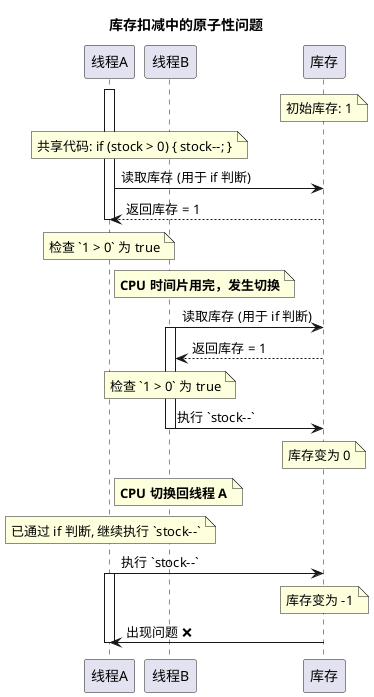
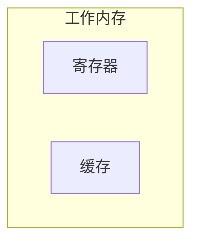
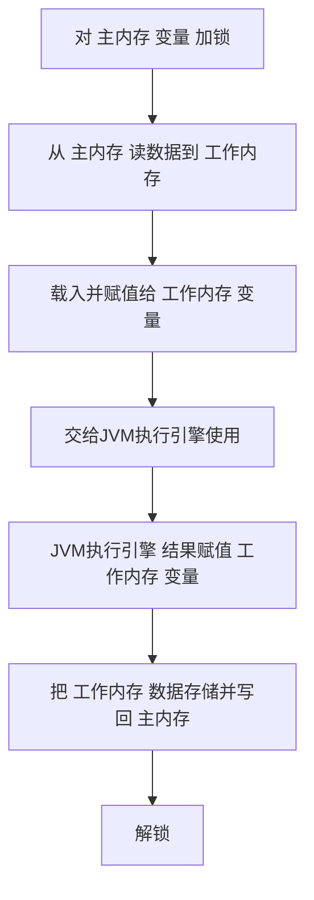

### **引子：面试官的"灵魂拷问"**

> 了解过 JMM 吗？为什么要有 JMM？知道八种内存交互操作吗？为什么要有这八种操作？了解过内存屏障吗？那为什么需要内存屏障呢？了解过 happens-before 规则吗？原子性、可见性、有序性，如何保证？

要聊 JMM，就得从计算机的发展史说起。

### **问题的根源：CPU 与内存的速度矛盾**
在计算机系统的发展过程中，存储设备的速度差异催生了多级缓存架构。由于磁盘I/O速度相对较慢，系统引入了内存作为缓存层，将程序数据预先加载到内存中，从而显著提升了程序执行效率。

| 存储器类型 | 访问时间 | 相对速度比较 | 相对内存速度(倍数) |
|------------|----------|--------------|-------------------|
| CPU寄存器  | 1纳秒    | 最快         | 100倍            |
| CPU缓存(L1)| 2-4纳秒  | 非常快       | 25-50倍          |
| CPU缓存(L2)| 10-20纳秒| 快           | 5-10倍           |
| 内存(RAM)  | 100纳秒  | 较慢         | 1倍              |
| 固态硬盘   | 25微秒   | 很慢         | 1/250倍          |
| 机械硬盘   | 8毫秒    | 极慢         | 1/80000倍        |

从上表可以看出,从CPU寄存器到机械硬盘,访问速度相差高达数百万倍。以内存访问速度为基准,CPU寄存器的访问速度是内存的100倍,而机械硬盘却只有内存速度的1/80000。这种巨大的速度差异正是引入多级缓存体系的根本原因。


然而，即使是内存的访问速度，相对于CPU的处理能力而言仍然存在较大差距。为了进一步缩小这一性能鸿沟，现代CPU设计中引入了多级缓存体系。在这种架构下，CPU首先将数据从主内存加载到高速缓存中，随后直接从缓存读取数据进行运算，完成计算后再将结果写回主内存。


现代CPU通常采用三级缓存架构：

- 一级缓存（L1）和二级缓存（L2）为每个CPU核（Core）私有，提供最快的数据访问速度
- 三级缓存（L3）则在多个核间共享，作为核间数据交换的缓冲区。


当一个核心修改了L1或L2缓存中的数据，并需要让其他核心可见时，这些数据会向上层缓存写入。如果这些数据最终被写入L3缓存，那么其他核心可以直接从共享的L3缓存读取，而不需要去更慢的主内存中获取，大大减少了数据同步的延迟。


那么问题来了：

#### 可见性问题
当一个 CPU 核心执行某个线程任务时，它修改了自己缓存中的数据，但这些数据还没有同步到主存中。此时，其他 CPU 核心去执行另外一个线程任务，它从主存中读到的数据不就是脏数据了吗？一个线程修改了共享数据，另外一个线程无法立即获得最新的共享数据，这就是**可见性问题**。

注意：可见性问题是发生在线程自己的工作内存（包括L1\2缓存）和主内存之间，问题就发生在其中1个核心修改了数据没有及时刷写回主内存。并且别的核读的时候就出现问题了（反正这个时候主内存和其他核自己缓存里面的数据都是旧数据）。


#### 有序性问题
问题又来了。在执行代码的时候，为了提升执行速度，CPU 或者编译器可能会对指令进行重排序，导致执行的顺序和代码的顺序不一致。
有些操作（如内存访问）可能需要较长时间。通过重排序，CPU可以在等待这些耗时操作完成的同时，去执行其他不依赖于这些结果的独立指令，从而避免CPU空闲，提高其利用率。

> **那么哪些指令会优先执行呢**？比如操作数已经ready、或者指令不依赖任何数据、允许提前Load数据以便后续计算使用的指令...

指令重排序可以保证单线程内串行执行的语义一致性，但是没有办法保证多线程并发执行的语义一致性。所以在多线程去访问一个共享变量时，某个线程就有可能在时间线上看到别的线程因为打乱顺序导致的"half-baked product"  (假设按照正常期望得到一个成品，但是因为调整了执行顺序，就看到了半成品)。

这就是**有序性问题**。


#### 原子性问题
问题又又又来了。在多线程并发的环境中，比如说，线程 A 读到的库存是 1，正想做库存减 1 的操作。但是，它只是读到了数据，还没执行减 1 的操作，CPU 的时间片就用完了。线程 B 拿到了时间片开始执行，把库存减 1，此时库存变成了 0。然后，线程 A 再执行减 1 的操作，库存就变成 -1 了。那库存能是负数吗？肯定不能。所以，**一个线程去执行一系列不可分割的操作时，在执行过程中却被其他线程插手了，这就是原子性问题**。




### JMM 的诞生：为了跨平台

所以，整个并发编程的核心，就是去解决可见性、有序性和原子性问题。操作系统通过内存模型定义了一系列规范去解决这些问题，但是不同的操作系统的内存模型是不同的。

> JMM 抽象的是主内存与工作内存的关系，数据是在两者之间来回流动的.

如果 Java 直接复用操作系统的内存模型，就有可能会导致同样一套代码，换了个操作系统它就无法执行了。但是 Java 当时的口号是什么？"一次编译，处处运行"。为了达到跨平台的目标，所以 Java 需要自己去提供一套内存模型，去屏蔽不同操作系统之间的差异。这就是 **Java 内存模型（Java Memory Model, JMM）**。


### JMM 的解决方案

那 JMM 是怎么解决问题的呢？ JMM 定义了一套并发编程相关的规范，抽象了缓存、线程、主存之间的关系，去解决这些问题。

JMM 强制 JVM 在实现时必须遵循它这个规范，要求 JVM 抽象出工作内存的概念，并规定了主内存与工作内存之间八大内存交互操作，来规范共享变量的读写。此外，JVM 还利用内存屏障这种 CPU 指令来禁止指令重排序，从而保证了有序性。对于可见性，例如 volatile 关键字就是通过强制从主内存读取最新值（禁用 CPU 缓存优化）来实现的。**具体内容下面会阐述。**


#### 方案1：工作内存与主存的抽象
JMM的抽象方式基于CPU执行指令的实际过程。在实际执行中，CPU需要将主存中的数据读取到缓存，然后再读取到寄存器中进行计算。基于这一机制，JMM将寄存器、缓存（L1/2）这些线程私有的存储区域统一抽象为**工作内存（Working Memory）**。



工作内存是线程私有的计算区域，每个线程的工作内存相互独立。线程在执行时必须将主存中的数据读取到自己的工作内存中，**完成计算后再将结果刷新回主存。**


#### 方案2：八大内存交互操作

抽象出了工作内存之后，JMM 规定了一套主存和工作内存之间的交互方式来读写数据。简单来说，就是一个共享变量如何从主存拷贝到工作内存，又如何从工作内存同步到主存。

针对这个问题，JMM 规定了八种主存与工作内存交互的原子操作：


| 操作 | 作用域 | 描述 |
|------|--------|------|
| lock（锁定） | 主内存的变量 | 把变量标识为一条线程独占的状态 |
| unlock（解锁） | 主内存的变量 | 解除变量的锁定状态 |
| read（读取） | 主内存的变量 | 把一个变量的值从主内存传输到线程的工作内存中 |
| load（载入） | 工作内存的变量 | 把 read 操作从主内存中得到的变量值放入工作内存的变量副本中 |
| use（使用） | 工作内存的变量 | 把工作内存中一个变量的值传递给JVM执行引擎 |
| assign（赋值） | 工作内存的变量 | 把一个从JVM执行引擎接收到的值赋给工作内存的变量 |
| store（存储） | 工作内存的变量 | 把工作内存中一个变量的值传送到主内存中 |
| write（写入） | 主内存的变量 | 把 store 操作从工作内存中得到的变量的值放入主内存的变量中 |


> "执行引擎"是一个JVM软件层面的抽象，执行引擎是JVM核心组件之一。
>
> Execution Engine职责是解释或编译（JIT编译）Java字节码，并最终将这些指令提交给底层的操作系统和硬件（包括CPU）去执行。
>
> 这个过程中Execution Engine会**管理Java线程的工作内存，并确保其对主内存的操作符合JMM的规定**，然后才将这些底层操作（如加载、存储）委托给操作系统和CPU去完成。


这八种操作实际上规定了主存与工作内存的交互流程：





#### 方案3：内存屏障（Memory Barrier）

八种内存操作和相关规则只是定义了数据交互的方式，可以做什么，但没有规定什么时候做，没有具体实现一个顺序的保证。所以，JMM 需要通过**内存屏障**去保证内存操作的顺序性和可见性。


**"内存屏障是一种 CPU 指令"**，主要有四种：

1.  **LoadLoad Barrier**：禁止屏障前的读操作和屏障后的读操作发生重排序。
2.  **StoreStore Barrier**：禁止屏障前的写操作和屏障后的写操作发生重排序。
3.  **LoadStore Barrier**：禁止屏障前的读操作和屏障后的写操作发生重排序。
4.  **StoreLoad Barrier**：禁止屏障前的所有操作和屏障后的所有操作发生重排序，开销最大。


举个例子，`volatile` 关键字能保证有序性和可见性（但无法保证原子性）。

* **有序性**怎么保证的呢？就是通过在适当位置插入内存屏障，禁止了指令的重排序。
* **可见性**怎么保证的呢？`volatile` 会告诉 JVM，当前变量在工作内存中的值是不确定的，需要从主存中去读。其本质上是禁用了 CPU 缓存的优化，每次都必须从主存中取值，从而保证一个线程的修改对另一个线程立即可见。


### Happens-Before：程序员相信JMM的最终承诺

八种内存交互操作在底层操作内存数据，内存屏障规定顺序和可见性。但是从程序员写代码的角度来看，你写一段代码，还是不知道编译器和处理器到底会怎么重排序、怎么优化。

JMM和Happens-Before的关系是什么？

可以这样类比：

- JMM 就像一部国家的《宪法》或一套完整的《法律体系》。 它设定了内存交互的**基本原则、框架和各种机制**（例如：主内存/工作内存的抽象，内存屏障的存在，八大原子操作的定义）。

- Happens-Before 规则就像《宪法》中的具体"法律条款"或"公民权利与义务的约定"。 它们是 JMM 这一大框架下（基本原则、框架和各种机制），直接指导程序员如何判断和保证内存可见性的**具体行为准则**，要求程序员"在我的基本原则、框架和各种机制约束下，你应该保证你的代码符合我的行为描述就可以了"。


因此，在谈论 JMM 时，如果不提及 Happens-Before 规则，那么 JMM 对于程序员来说就仅仅是一个抽象的概念，无法转化为具体的并发编程实践。Happens-Before 规则将 JMM 的复杂性转化为可理解、可操作的准则，是 JMM 对程序员最重要的"出口"。


**总结的说**：JMM 是一个底层的规范，定义了内存操作的行为。而 Happens-Before 规则是 JMM 暴露给程序员的高层抽象。它将复杂的底层内存操作和优化行为，转化成了程序员可以理解和遵循的可见性语义。


**Happens-before 规则一共有八条，这里举例5条比较常见的：**


##### 程序顺序规则
在一个线程内，按照代码行数顺序，写在前面的操作 对于写在后面的操作来说是可见的，也就是JMM的存在会保证你的代码执行最后结果和代码顺序结果是一致的。怎么保证呢？—— **没有数据依赖的指令可以重排序，否则一律不许重排序**。*这也被成为as-if-serial 语义*


打个比方int a=1;int b=3; int c = a + b; 对于这三行代码构成的程序来说。JMM能够保证你的答案为4，因为c这行代码有依赖，所以不管ab赋值谁先谁后，都能保证c是最后执行的。


##### 监视器锁规则
一个 unlock（释放锁）操作 Happens-Before 之后对同一个锁的 lock（获取锁）操作。这确保了在释放锁之前，同步块内的所有内存写入操作都对后续获取同一把锁的线程可见。它限制了锁释放前的操作与锁获取后的操作之间的重排序。

打个比方。

```java
private int value = 0;
private final Object lock = new Object(); // 监视器锁

public void write() {
    synchronized (lock) { // 线程 A: 获取 lock
        value = 10;      // 操作 L1：写入共享变量 value
    } // 线程 A: 释放 lock
}

public int read() {
    synchronized (lock) { // 线程 B: 获取 lock
        return value;    // 操作 L2：读取共享变量 value
    } // 线程 B: 释放 lock
}
```

A线程write+write之后，B现在想要获取lock，那么JMM就能给你保证，B来读取，来读到的"在A线程内存里修改过的value"，你一定能在主存读到最新值（而不是读到不一致的值）


##### 线程启动规则
`Thread` 对象的 `start()` 方法 happens-before 于此线程的每一个动作。在某个 `Thread` 实例启动之前，保证前面的代码（你理解有初始化作用的）不会比 `thread.start()` 调用滞后。

```java
class MyRunnable implements Runnable {
    int x = 0; // 共享变量

    @Override
    public void run() {
        System.out.println("新线程中 x 的值: " + x); // 操作 S2：新线程读取 x
    }
}

// 主线程
MyRunnable r = new MyRunnable();
r.x = 10; // 操作 S1：主线程写入 x
Thread t = new Thread(r);
t.start(); // 操作 S3：主线程启动新线程
```


JMM根据线程启动规则，保证了你S1一定在SS之前修改完成并对新线程可见。不会说新线程的读取操作排到新线程start()之前。


##### 线程终止规则
一个线程的所有操作都 Happens-Before 对该线程的终止检测。这确保了被终止线程在结束前对共享变量的所有写入操作，都对检测到它终止的其他线程可见。如下例子：

JMM就能够保证子线程里面的操作，都在结束前（worker.join()）生效并且对主线程或者任何其他线程可见。

```java
    class WorkerThread extends Thread {
        int result = 0; // 共享变量

        @Override
        public void run() {
            result = 42; // 操作 T1：工作线程写入 result
            System.out.println("工作线程执行完毕。");
        }
    }

    // 主线程
    WorkerThread worker = new WorkerThread();
    worker.start();
    worker.join(); // 操作 T2：主线程等待 worker 终止
    System.out.println("主线程看到的结果: " + worker.result); // 操作 T3：主线程读取 result
```


##### 传递性规则
如果 A happens-before B，且 B happens-before C，那么 A 一定 happens-before C。**这个规则通常与其他 Happens-before 规则结合使用来推断可见性**。

和上面的例子不一样，他是一个综合起来的讨论。它将多个独立的 Happens-Before 关系串联起来，形成一个更长的可见性链条。下面举个例子：


```java
public class TransitivityExampleSimplified {
    private static int data = 0; // 共享变量

    public static void main(String[] args) throws InterruptedException {
        Thread thread1 = new Thread(() -> {
            data = 100; // 这就是"操作 A"：线程 1 修改 data
        });

        thread1.start(); // 启动线程 1
        thread1.join();   // 这就是"操作 B"：主线程等待线程 1 终止

        System.out.println("Data: " + data); // 这就是"操作 C"：主线程读取 data
    }
}
```


- A Happens-before B，因为B代表线程结束退出（join）
- join返回的值修改一定会被C操作看到，B Happens-before C
- 根据传递性，保证了A一定先于C，也就是**A Happens-before C。** 

传递性规则使得我们能够连接不同线程间的同步点，从而推导出更复杂的可见性保证


### Java 并发工具：JUC

讲完了JMM，自然而然的就要衔接到未来需要详细讲解的JUC包。

JMM 提供了强大的理论基础和规范，同时为了简化并发编程、避免程序员重复造轮子，并帮助开发者更高效、更安全地构建多线程应用，Java 并发包简称（*JUC*）应运而生。

JUC 提供了一系列高级、抽象的工具和框架，它们在底层严格遵循 JMM 的规范（比如volatile关键字），**将一些诸如内存屏障和 CAS 操作的底层细节封装了起来**，解放了程序员，允许我们站在更高的抽象层次上编写代码来确保并发的正确性。

没有JUC，我们写一个多线程之间的开关，可能要我们考虑将修改刷写到主内存，我们还要考虑插入内存屏障不要让指令重排序。有了JUC，我们用volatile就可以了。这就是JUC带来的好处，我们考虑的点，从上面所述两个考虑转换为了“我们几个线程阅读这个开关就好了，开关已开我们就执行定义好的业务逻辑！” 相信你应该能理解前后我们思考的抽象的层次的区别吧！

这些工具封装了复杂的同步机制，让开发者能够专注于业务逻辑，而非底层内存同步细节，看看他们在哪些方面解放了我们的双手（*其实是脑子🤣*）

- **在同步机制上提供解放**：synchronized 关键字：内置同步机制，确保原子性、可见性和有序性，但可能影响并发性能。
- **在可见和有序性上提供解放**：volatile 关键字：主要解决可见性和有序性问题，通过内存屏障防止指令重排序并强制从主内存读取，但不保证原子性。
- **在原子操作上提供解放**：CAS 机制与 Atomic 包：基于乐观锁思想，实现无锁原子操作，仅保证原子性，在特定场景下提供更优性能。
- **在锁机制上提供解放**：锁机制与 java.util.concurrent.locks 包：如 ReentrantLock 等显式锁，提供更细粒度的控制和更灵活的并发解决方案。
- **在数据结构、任务执行和线程协作层面方面提供解放**：并发集合、线程池、同步工具：包括 ConcurrentHashMap、ExecutorService、CountDownLatch 等，从数据结构、任务执行和线程协作层面解决并发问题，显著提升开发效率和性能。


### 总结

综上所述，Java 内存模型（JMM）是 JVM 实现的一套核心规约，旨在通过抽象内存结构、规范内存交互操作以及利用内存屏障等机制，确保 Java 程序在多线程环境中的可见性、有序性、原子性，从而实现"一次编写，处处运行"的跨平台并发语义一致性。

对于程序员而言，我们无需深究 JMM 的底层细节，只需遵循 Happens-Before 规则这一高层契约，即可有效判断并保证并发代码的逻辑预期。Happens-Before 规则正是 JMM 在其底层规范和约束下，赋予程序员的行为准则。

与此同时，在 JMM 的基础之上，JDK 提供了 `java.util.concurrent`（JUC）包，它将复杂的内存屏障、CAS 等底层并发原语封装为易用的高级工具，极大地简化了多线程编程的复杂性，解放了开发者，使其能够专注于业务逻辑的实现，而无需直接与底层的缓存同步和内存屏障等机制打交道。


