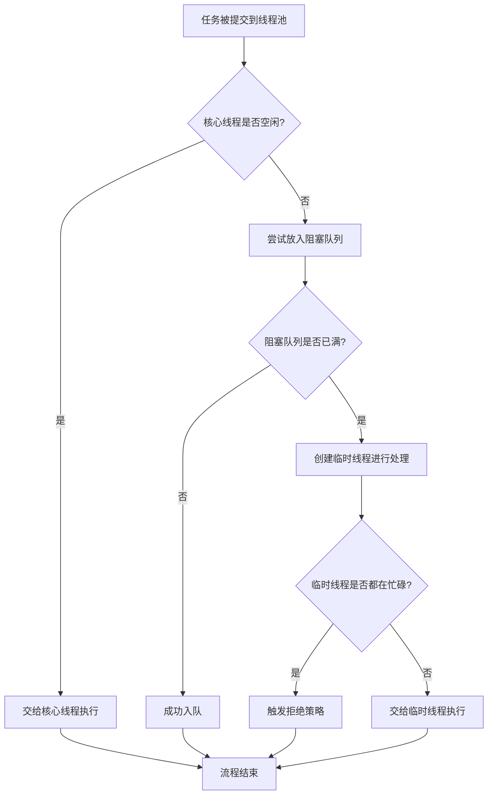

## 引子：线程池"拷打"

在今天的这篇文章里，我将讲讲如下几个问题：
- 为什么 Java 中线程创建和销毁的开销比较大？
- 线程池的原理是什么？
- 怎么样才能让线程池不去拒绝任务？
- 动态参数的线程池应该怎么设计，或者说怎么在不重启应用的情况下，动态地调整线程池的核心参数？
- 那怎么去监控线程池的状态，或者说怎么自己设计一个简单的线程池监控呢？

## 为什么需要线程池？

当有大量的任务需要被执行的时候，你就想到了使用多线程。正要 `new Thread()`，调用 `start()` 方法的时候，又想到了线程资源很昂贵，频繁地创建和销毁开销很大。

那为什么线程的创建和销毁开销比较大呢？Java 线程模型是"一对一"的，也就是说，一个 Java 线程对应了一个操作系统的内核级线程。那么创建一个 Java 线程，就需要通过系统调用，让操作系统切换到内核态去创建内核级线程，这就涉及到了用户态和内核态的切换、线程资源的分配、栈空间的分配等。同样的，销毁线程也需要操作系统切换到内核态去回收这些资源。所以，Java 中线程的创建和销毁开销非常大。

然后呢，Java 21 就出现了虚拟线程（Virtual Thread），或者说协程。它就是"多对多"的线程模型，基于用户态的调度，所以很轻量级。但是大部分企业的应用还是run在JDK8上面。

```java
import java.util.concurrent.Executors;

public class CoroutineExample {
    public static void main(String[] args) {
        try (var executor = Executors.newVirtualThreadPerTaskExecutor()) {
            executor.submit(() -> {
                System.out.println("Hello from a virtual thread!");
            });
        }
    }
}
```

那既然 Java 8 线程的创建和销毁开销都比较大，有没有一种可能，可以把创建好的线程放入到一个容器中，需要用的时候再去拿，然后用完之后我也不销毁，而是放回去？这样每次复用容器中已存在的线程，就能避免线程频繁地去创建和销毁了 —— 这就是我们经常说的线程池。

## 线程池的核心工作原理

一般情况下，线程池中的线程数量有限，而需要处理的任务往往成百上千。对于线程无法立即处理的任务，它们会排队等待。线程池通常会使用一个阻塞队列（BlockingQueue）来存放暂时无法处理的任务。当线程完成当前任务后，会从阻塞队列中取出新的任务进行处理。

### # 阻塞队列满了怎么办？

阻塞队列的大小通常是有上限的。当队列已满时，表明当前系统任务量较大，压力增加。此时，线程池可以创建一些临时线程来紧急处理任务。当这些临时线程完成手头的任务并空闲后，如果队列中没有更多任务，它们就应该被销毁。因此，需要为临时线程设置一个最大空闲时间，超过该时间后线程将自动销毁。

### # 临时线程满时的处理

如果任务量持续很大，导致阻塞队列已满，并且所有临时线程都在忙碌，此时到来的新任务就需要一套拒绝策略（Rejection Policy）来处理。

那么问题又来了，如果任务量它就是很大，阻塞队列满了，临时线程也都在忙，这时候来了新任务应该怎么办？

这就需要定义一套拒绝策略（Rejection Policy）来拒绝这些新来的任务了。

### # 谁来创建线程？

那么问题又又来了，这个线程池应该以什么样的方式创建线程呢？应该创建什么样的线程呢，普通线程还是守护线程？那创建线程的时候应该怎么给线程命名呢？所以，最好要搞一个线程工厂（ThreadFactory）来统一负责创建线程，顺便可以根据业务去给线程和线程池命名。

这样的话，业务出问题就能定位到对应的线程池和线程，线程出了问题也能定位到具体的业务。所以，这也说明了**不同的业务共用一个线程池肯定是不好的，不同的业务最好要用不同的线程池**。比如著名的parallelStream()的使用ForkJoinPool这件事儿就被广大开发者诟病，将其的直接使用视为CodeReview里面的BadCase。


## 线程池的七大参数与执行流程

以上呢，就是线程池的七大核心参数了，**特别注意，尤其是和maximumPoolSize相关的工作线程何时创建、以及任务何时入队这个描述，太容易混淆了**。

1. 核心线程数 (corePoolSize)：当一个任务被提交到线程池的时候，如果核心线程空闲（*涉及到corePoolSize*），那就交给核心线程去执行
1. 阻塞队列 (workQueue)：核心线程不空闲，尝试放入阻塞队列。如果阻塞队列没满（*涉及到workQueue*），就成功入队。
1. 最大线程数 (maximumPoolSize)：**如果队列满了**，就创建临时线程（*涉及到maximumPoolSize*）进行处理。**注意！这里不是corePoolSize满了就创建其他worker thread，而是线程满了才创建这几个临时工**
1. 拒绝策略 (handler)：正式工和临时工都忙着，就只能拒绝，如果是CallRunPolicy，**那就是转交给投放任务的业务线程去执行，这是会拖慢原有业务的速度的，所以除非是业务不允许丢弃任务，一般不要用这个策略**
1. 线程工厂 (threadFactory)：一般是定义名字之类的
1. 临时线程的空闲时间 (keepAliveTime)：如果一个非核心线程的空闲时间超过了 keepAliveTime 所设定的值，那么这个线程就会被终止并从线程池中移除
1. 时间单位 (unit)：keepAliveTime单位，这个不解释


> 放入任务到线程池的过程就涉及前四个核心定义参数，面试的时候可以先说这四个。其他三个，一个可以用“自定义名称”的方式另外两个可以用“临时线程销毁”带上。


如图：



## 如何让线程池不拒绝任务？

那么问题来了，我不想拒绝任务怎么办？

一种常见的误解是，可以通过将阻塞队列设置为无界队列来避免任务拒绝。然而，虽然队列可以无界，但服务器的内存是有限的。随着任务的不断增加，内存最终会耗尽，导致频繁的 Full GC，并最终触发 OOM (OutOfMemoryError)。

因此，需要更可靠的解决方案。

### # 方案一：CallerRunsPolicy

有个拒绝策略叫 `CallerRunsPolicy`，它的作用就是"谁往线程池中提交任务，谁就去执行这个任务"。这种方式确实可以避免丢弃任务，但是让业务线程（比如处理前端请求的 Tomcat 线程）去执行这些耗时任务，可能会导致业务线程被拖慢，没有办法及时地处理前端发来的请求。所以，这个拒绝策略只能适用于**低并发、且不想丢弃任务**的场景。

### # 方案二：任务持久化（推荐）

你又想性能好，又不想丢弃任务，那怎么办呢？

你想想操作系统中学到的内存和磁盘：想要内存中的数据断电不丢失，就要持久化到磁盘中。再想想操作系统中虚拟内存的请求分页：当无法加载所有数据到内存的时候，只加载必要的，需要其他数据时再触发缺页中断，然后从磁盘中读入内存。

所以，线程池想要任务不被丢弃，就要做**任务持久化**。我们可以自定义拒绝策略，把需要拒绝的任务存到 MySQL、Redis 或者 MQ 中。然后，重写线程池的 `afterExecute()` 方法。当线程池执行完一个任务的时候，说明此时线程池有可能空闲了，那么就判断一下线程池中阻塞队列的大小。如果说阻塞队列还比较空，那么就从 MySQL、Redis 或者 MQ 中读取之前持久化的任务，然后放入线程池的阻塞队列中再进行处理。这样就做到了不丢弃任务。

下面提供一个由persistedTaskQueryService提供任务查询的重写案例：

```java
@Override
protected void afterExecute(Runnable r, Throwable t) {
  super.afterExecute(r, t); // 调用父类方法
  if (this.isShutdown() || this.isTerminating() || this.isTerminated()) {
      return;// 如果线程池正在关闭，则不进行任务拉取
  }

  // 检查阻塞队列是否空闲 (任务数低于阈值)，并且模拟数据库中有待处理的任务
  if (getQueue().size() < RESUBMIT_THRESHOLD && persistedTaskQueryService.getPersistedTaskCount() > 0) {
      List<Runnable> tasksToResubmit = MockDbService.getTasksFromDb(2); // 每次尝试拉取2个任务
      for (Runnable task : tasksToResubmit) {
          try {
              System.out.println("重新提交来自DB的任务: " + task.toString());
              execute(task); // 重新提交任务
          } catch (RejectedExecutionException ree) {
              // 如果重新提交时再次被拒绝，说明线程池仍然很忙或已关闭
              MockDbService.saveTaskToDb(task); // 再次存入“DB”
              System.err.println("重新提交的任务再次被拒绝: " + task.toString());
          }
      }
  }
}
```

除了重写 `afterExecute()` 方法之外，还可以自定义一个组合队列。当线程从阻塞队列中取任务的时候，判断一下队列中任务量的多少。如果队列中任务比较少，那就主动从 MySQL、Redis、MQ 中去读取那些被持久化的任务，然后读到阻塞队列里，线程池就可以执行这些任务了。这也同样做到了不丢弃任务。

## 如何设计动态参数的线程池？

或者说，怎么在不重启应用的情况下，动态调整线程池的核心参数？

其实，线程池本身就提供了一系列的 `set` 方法，能够让你在运行时去修改核心参数，比如说 `setCorePoolSize()`、`setMaximumPoolSize()` 等等。调用这些 `set` 方法就能去动态地修改核心线程数、最大线程数等参数了。

然后，我们可以把这些配置放到配置中心里面（如 Nacos、Apollo）。线程池去监听配置中心，当配置中心发生了配置变化的时候，线程池就能够监听到，然后调用 `set` 方法动态地去修改这些参数。

但是有一个问题，Java 中的阻塞队列的容量是用 `final` 修饰的，也就是说，阻塞队列的大小是不可变的。这里你要想实现阻塞队列大小可变，想要实现动态的阻塞队列，那就得自己重新写一个大小可变的阻塞队列。
```java
public class ResizableBlockingQueue<E> implements BlockingQueue<E> {
    ReentrantLock lock = new ReentrantLock(); //锁的是 Capacity
    Condition notEmpty = lock.newCondition(); // 消费者等待条件：队列非空
    Condition notFull = lock.newCondition();  // 生产者等待条件：队列非满
    internalQueue = new LinkedList<>(); // 内部存储
    volatile int currentCapacity; // 当前队列的最大容量，volatile保证可见性
   
  	public ResizableBlockingQueue(int initialCapacity) {
        //ignore constructor
    }
  
    /**
     * 动态调整队列的最大容量。
     * 线程安全地更新容量，并处理可能超出新容量的元素，同时唤醒等待中的线程。
     */
    public void setCapacity(int newCapacity) {
        //ignore param check
        lock.lock(); // 获取锁，保证线程安全
        try {
            int oldCapacity = this.currentCapacity;
            this.currentCapacity = newCapacity; // 更新容量

            // 如果新容量小于当前元素数量，需要移除多余元素
            while (internalQueue.size() > newCapacity) {
                internalQueue.remove(0); // 简单示例：移除队列头部的元素
            }

            // 如果容量变大，唤醒可能因队列满而等待的生产者
            if (newCapacity > oldCapacity) {
                notFull.signalAll(); // 通知所有等待的生产者可以尝试入队了
            }
            // 同样，如果容量变化可能影响消费者（例如，有元素被移除导致队列空），也通知消费者
            notEmpty.signalAll(); // 通知所有等待的消费者可以尝试出队了
        } finally {
            lock.unlock(); // 释放锁
        }
    }

    /**
     * 将元素放入队列，如果队列满则阻塞。
     * 这是BlockingQueue的核心put方法的一个简化实现。
     */
    public void put(E e) throws InterruptedException {
        lock.lock();
        try {
            while (internalQueue.size() == currentCapacity) {
                notFull.await(); // 队列已满，生产者线程等待 notFull 条件
            }
            internalQueue.add(e); // 添加元素到队列尾部
            notEmpty.signal(); // 通知一个等待的消费者：队列非空了
        } finally {
            lock.unlock();
        }
    }

    /**
     * 从队列中取出元素，如果队列空则阻塞。
     * 这是BlockingQueue的核心take方法的一个简化实现。
     */
    public E take() throws InterruptedException {
        lock.lock();
        try {
            while (internalQueue.isEmpty()) {
                notEmpty.await(); // 队列为空，消费者线程等待 notEmpty 条件
            }
            E item = internalQueue.remove(0); // 从队列头部取出元素
            notFull.signal(); // 通知一个等待的生产者：队列非满了
            return item;
        } finally {
            lock.unlock();
        }
    }
}
```


这样，就实现了不重启应用，通过修改配置中心的配置，就可以动态地去调整线程池的核心参数了。实际的 BlockingQueue 实现还需要实现更多的方法，如 offer, poll, size, remainingCapacity 等。这里为了简洁，仅展示了核心的容量调整和 put/take 逻辑。

## 如何监控线程池的状态？

或者说，自己怎么设计一个简单的线程池监控呢？

- **第一步：定义指标。** 你得定义一系列的线程池监控指标，比如说：
    - 活跃线程数、线程池当前总线程数、阻塞队列当前大小、已完成任务数、总任务数等等。
- **第二步：采集指标。**
    - 方法1：用定时任务，每隔几秒采集一下这些指标数据
    - 方法2：像上面一样，重写 `afterExecute()` 或者 `beforeExecute()` 方法，在任务执行前后去采集；或者说在任务提交的时候去采集这些指标数据。
- **第三步：上报与展示。** 把这些指标数据上报到监控系统里面（如 Prometheus），通过可视化图表（如 Grafana）的方式去展示这些指标数据就可以了。
